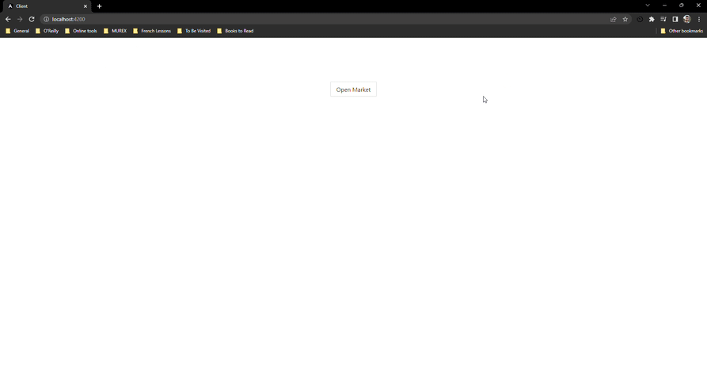

# Stock Market

This project is a playaround with Event-Sourcing software architecture.

Tools used:
- RabbitMQ
- MongoDB
- Spring Boot
- Angular

# Running the Project

## Prerequisites:
If you want to run the project locally at your machine you will need:
- Docker and Docker Compose to start RabbitMQ and MongoDB
- Java 11 to run the server
- NPM to run the client

# How To Run
1. From the root level, open a command line and run the following command to run rabbitmq and mongo services
    
        docker compose up -d
2. Run the Spring Boot application under directory `/server`
3. Run the NPM application under the directory `/client` by running the following command:
   
        npm run start

# Overview
